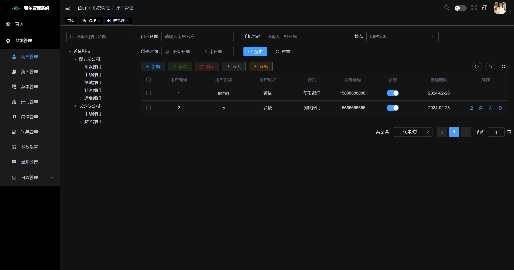
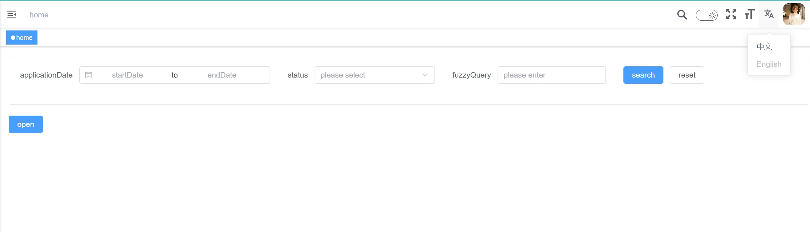

### 技术栈

> Vue3
>
> ElementPlus
>
> TypeScript
>
> Vite
>
> Pinia

### 删除不必要的组件和方法
只保留了首页和系统设置以及头部

### 升级依赖除了ElementPlus，因为inline表单有样式问题为解决

### 新增了一些组件如：上传组件`Upload`、导入组件`ImportUpload`、表格展示组件`ShowTable`等

### 增加了暗黑模式

### 新增了国际化
